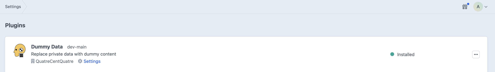
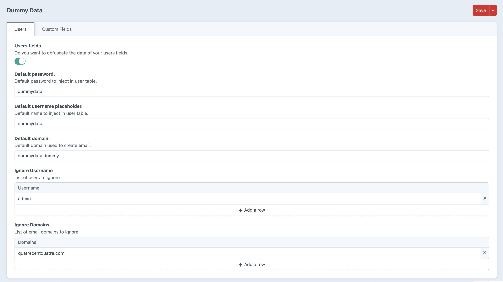
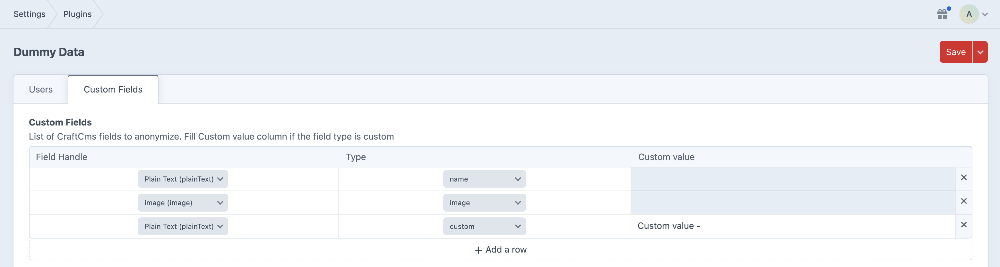
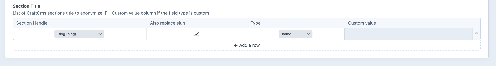

# Dummy Data

Dummy Data is a CraftCms plugin used to anonymize sensible data in the database with dummy data. 

This plugin was created to comply with new privacy laws in Canada that require personal data to be accessible only on the production environment. These measures are also recommended in Europe with the GDPR.

To configure your project, you will need to map the fields that need to be anonymized to the data type they represent. Your configuration is saved in the project config files of CraftCMS and every development environment will have access to this feature.

A console command is provided to run the anonymization of your project. 

*Note: the script will not run if your website is in production mode.

## Requirements

This plugin requires : 
- Craft CMS 5.0.0 or later.
- PHP 8.2 or later.
- Mysql database

## Installation

You can install this plugin from the Plugin Store or with Composer.

#### From the Plugin Store

Go to the Plugin Store in your project’s Control Panel and search for “Dummy Data”. Then press “Install”.

#### With Composer

Open your terminal and run the following commands:

```bash
# tell Composer to load the plugin
composer require quatrecentquatre/craft-dummy-data

# tell Craft to install the plugin
./craft plugin/install craft-dummy-data
```

#### Validate the installation



## How it works

With some simple configuration in the settings page of the plugin or with a configuration file in your project, you will be able to replace sensible data with random data.

The plugin can help replace data in user information, in different sections of CraftCMS or in specific tables in the database.


### User

In the plugin configuration, you can activate the option to anonymize the user data. You can choose a defaut password, username and domain name to generate the content.

You can also list an array of username or domain to ignore.

* All username and email are concatenate with the row ID in order to be unique.



### Custom Fields

In the plugin configuration, add rows to the table with the fields that needed to be anonymize with the type of content that the data should be replace with.

The script will replace all the rows in the database that have data in it. 

The handle key is the handle of your field in your Craft control panel. (The script will get the field prefix/suffix if needed from the database.)

If you choose the type : "custom", you could write a custom value for this specific field.

* Note if a field is used in multiple instance in an entrytype, the field must be select in the dropdown an all of his siblings will be updated.



#### Title and slugs

If you need to overwrite the title field, you can also choose a section and select if you want to replace the title by a certain value and his slug. (The slug will also be updated in the uri field.)



### Custom Tables

You can also specify multiple custom tables and select each column that needs to be anonymized. The custom table needs to be added by a configuration file in the project (See the Config file section below.)

### Data Types

#### List of string data types supported

- address
- city
- date
- email
- firstName
- ip
- lastName
- latitude
- longitude
- name
- phoneNumber
- postcode
- secondaryAddress
- stateAbbr
- streetName
- streetAddress
- text
- userName
- url
- userAgent

For more informations about what kind of data each type return, you can look up the Faker PHP documentation. [Faker PHP](https://fakerphp.github.io/formatters/)


#### Files

- compressed (.zip)
- excel (.xlsx)
- image (.jpg)
- pdf (.pdf)
- txt (.txt)
- video (.mp4)
- word (.docx)

#### Config file

It is possible to use a configuration file to overwrite the CMS settings

Create a file to configure your project : config/dummy-data.php

```
<?php 

return [
    'clean_users' => 1,
    'users_defaultPassword' => '4cent4',
    'users_ignoredUsername' => [
                                ['username' => 'admin'],
                            ],
    'users_ignoredDomains' => [
                                ['domain' => 'test.ca']
                            ],
    'users_usernameDefault' => 'dummy-data',
    'users_emailDomainDefault' => 'test.ca',
    'custom_fields' => [
        ['type' => 'text', 'handle' => 'craft_field_handle'],
    ],
    'custom_tables' => [
        [
            'name' => 'custom_table_name',
            'custom_fields' => [
                ['type' => 'email', 'handle' => 'custom_table_column'],
            ],
        ]
    ]
];
```

#### Custom value

It is possible to add custom value to a specific field. The type will be custom and an extra "value" key will be add to the array.

```
'custom_fields' => [
    ['type' => 'custom', 'handle' => 'craft_field_handle', 'value' => 'Custom value'],
],
```

### Run the script

Run the following command in your terminal.

```
php craft dummy-data/generate
```

For security purpose, this command can't be run in production and a prompt will ask if you really want to replace your content.

A database backup is advice before updating the content of your database and it is recommended to clear the cache after running the script.


### Roadmap

- Add action in CMS to launch script
- Edit custom table in Control Panel
- Add complex mode. Modify each entries individually with different data with queue system

### Credits
Developped by : [QuatreCentQuatre](https://www.quatrecentquatre.com)<br>
Developper : [Robin Gauthier](https://github.com/robin-gauthier)